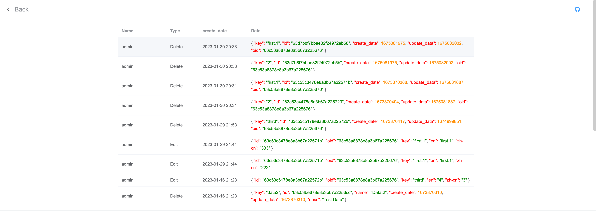

## Description

Online translation server built with nestjs + vue3

## Installation

### Download docker images

```bash
$ docker run --name i18nserver  \
    -v ~/localdbdata/data:/data/db  \
    -v ~/localdbdata/backup:/data/backup  \
    -v ~/localdbdata/nestcode:/var/www/  \
    -v ~/localdbdata/conf:/data/configdb  \
    -e MONGO_INITDB_ROOT_USERNAME=i18nuser \
    -e MONGO_INITDB_ROOT_PASSWORD=i18paddword \
    -p 27017:27017 \
    -p 80:80 \
    -d zhaileipc/i18n
```

### Config MongoDb

```bash
$ db.auth("i18nuser","i18paddword");  
	//Login
```

```bash
$ use i18n; 
	//create i18n models
```

```bash
$ db.createUser({user : "i18nserver",pwd : "i18nserver",roles: [{ role : "readWrite", db : "i18n" }]}); 
	//create db user
```

### Start Server

```bash
$ cd /var/i18nserver/file/
$ pm2 start 
```

## Enjoy

### First time login please use account: admin, password: admin





